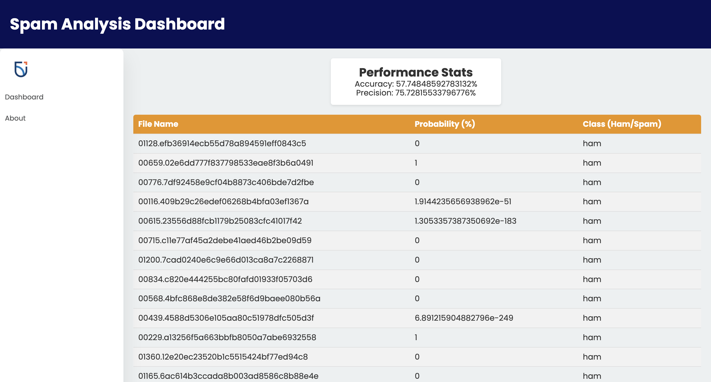

# Assignment 01 - Spam Detector

## Project Information

Spam Detector is a project aimed at filtering out spam emails using a machine learning-based approach. The program utilizes a unigram [1] approach where each word in the email is counted and associated with whether the message is spam or not. By training the system on a dataset of emails, it learns to recognize patterns and calculate probabilities based on word frequencies [2].

### Group Members
- Adlene Oudahmane
- Abdul Rahim Mohsin
- Jason Badwal
- Rania Rejdal

**Precision:** 75.72815533796776%  
**Accuracy:** 57.74848592783132%

## Improvements

We made several improvements to the interface and model:
- Corrected probability calculations in the model to ensure accurate classification.
- Enhanced error handling and logging for better debugging and maintenance.
- Improved efficiency in file reading operations for faster processing.
- Utilized modern Java features for cleaner and more maintainable code.
- Improved user interface for better user experience.

## How to Run

Follow these steps to clone and run the application:

1. Clone the repository: git clone https://github.com/OntarioTech-CS-program/w24-csci2020u-assignment01-mohsin-oudahmane-badwal-rejdal.git
2. Navigate to the project directory: cd w24-csci2020u-assignment01-mohsin-oudahmane-badwal-rejdal
3. Open project directory as an IntelliJ IDEA project.
4. Setup GlassFish configuration with the provided URL: [http://localhost:8080/spamDetector-1.0/api/spam](http://localhost:8080/spamDetector-1.0/api/spam)
5. Open index.html file to view results.

### References
[1] https://en.wikipedia.org/wiki/Bag-of-words_model

[2] https://en.wikipedia.org/wiki/Naive_Bayes_spam_filtering
